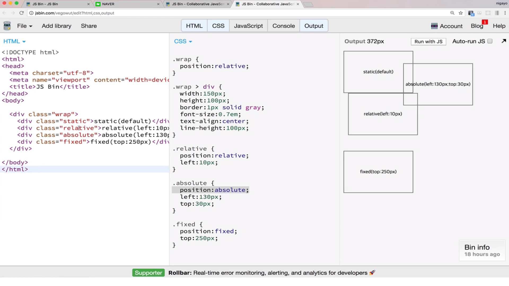

## CSS 기본 Style 변경하기

### 웹 폰트

엘리먼트가 배치되는 방식

엘리먼트를 화면에 배치하는 것을 layout 작업이라고도 하고, Rendering 과정이라고도 합니다.편의상 우리는 배치라고 할 겁니다.
기본 엘리먼트는 위에서 아래로 배치되는 것이 기본입니다.
하지만 웹사이트의 배치는 다양하게 표현 가능해야 하므로, 이를 다양한 방식으로 배치할 수 있도록 다양한 속성을 활용합니다.
중요하게 이해해야 할 속성은 다음과 같습니다.

~~~
display(block, inline, inline-block)
position(static, absolute, relative, fixed)
float(left, right) (기본 element를 벗어나서 둥둥떠다니는 느낌)
~~~

### display

display:block = 위에서부터 쌓이는 느낌 
div는 display가 블럭속성이기 때문에 그렇다.

 

display:inline = 옆으로 흐르는 느낌
display 속성이 inline인 경우는 우측으로, 그리고 아래쪽으로 빈자리를 차지하며 흐릅니다.
높이와 넓이를 지정해도 반영이 되지 않습니다.

### position
엘리먼트 배치가 순서대로만 위아래로 또는 좌우로 흐르면서 쌓이기만 하면, 다양한 배치를 하기 어렵습니다.
position 속성을 사용하면 상대적/절대적으로 어떤 위치에 엘리먼트를 배치하는 것이 수월합니다.

1. position 속성으로 특별한 배치를 할 수 있습니다.
position 속성은 기본 static입니다.
그냥 순서대로 배치됩니다.

2. absolute는 기준점에 따라서 특별한 위치에 위치합니다.
top / left / right / bottom 으로 설정합니다.
기준점을 상위엘리먼트로 단계적으로 찾아가는데 static이 아닌 position이 기준점입니다.

3. relative는 원래 자신이 위치해야 할 곳을 기준으로 이동합니다.
top / left / right / bottom로 설정합니다.

4. fixed는 viewport(전체화면) 좌측, 맨 위를 기준으로 동작합니다.

absolute의 기준점은 상위 엘리먼트의 스태틱 말고 부모에 wrap이 있고 wrap은 relative로
정하였다. absolute 같은 경우에는 top left를 꼭 주는것이 좋다. 즉 여기서는 
absolute가 static 박스의 왼쪽 맨위부터 시작을 한다. 그래서 오른쪽에 동떨어져 있는 
모습을 볼 수가 있다.

하지만 여기서 부모중에 static이 없으면 body를 기준점으로 잡니다.

-참고자료-
부스트코스 - 웹프로그래밍

  

