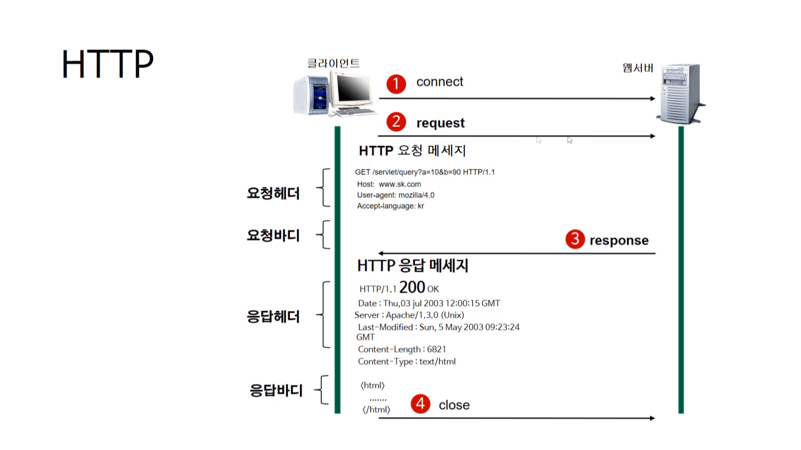

##1-2) 웹의 동작(HTTP 프로토콜의 이해)

 

학습 목표
   - HTTP프로토콜의 작동방식
   - HTTP프로토콜의 요청/응답 데이터 포맷

인터넷 = WWW(world wide web)

인터넷 기반의 대표 서비스 중 하나

|  
이름
 |  
프로토콜
 |  
포트
 |  
기능
 |
|:--------|:--------:|--------:|--------:|
| 
 WWW 
 | 
 HTTP 
 | 
 80 
 | 
 웹서비스 
 |
| 
 Email 
 | 
 SMTP/POP3/IMAP | 
 25/110/114 |
이메일 서비스 
 | 
| 
FTP 
 | 
 FTP 
 | 
 21 
 | 
파일 전송 서비스 
 |
| 
DNS 
 | 
 TCP/UDP 
 | 
 53 
 | 
네임 서비스 
 |
| 
NNTP 
 | 
 NNTP 
 | 
 119 
 | 
인터넷 뉴스 서비스 
 |

   - 인터넷(Internet)
   TCP/IP 기반의 네트워크가 전세계적으로 확대되어 하나로 연결된 네트워크들의 네트워크(네트워크의 결합체)

   - HTTP(Hypertext Transfer Protocol)란?

   - HTTP는 서버와 클라이언트가 인터넷상에서 데이터를 주고 받기 위한 프로토콜
   - HTTP는 계속 발전하여 HTTP/2까지 버전이 등장한 상태이다.
   - HTTP는 어떤 종류의 데이터도 전송 할 수 있도록 설계가 되어있다. 이미지 동영상
  텍스트 문서등 종류를 가리지 않고 전송할 수 있다.

  
### HTTP 작동방식
- HTTP는 서버/클라이언트 모델을 따른다.
- 무상태 프로토콜

장점 : 불특정 다수를 대상으로 하는 서비스에는 적합합니다. 클라이언트와 서버가 계속 연결된 형태가 아니기 때문에 클라이언트와 서버간의 최대 연결수보다 훨씬 많은 요청과 응답을 처리할 수 있습니다.

단점 : 연결을 끊어버리기 때문에, 클라이언트의 이전상황을 알 수가 없습니다. 이러한 특징을 무상태라고 말합니다. 이러한 특징 때문에 정보를 유지하기 위해서 Cooke와 같은 기술이 등장하게 되었습니다.

결론 : 최대 연결수보다 더많은 요청과 응답을 할 수 있지만 연결이 끊기기 때문에 클라이언트의 이전상황을 알 수 없습니다. 예를 들어 쇼핑몰에서 쇼핑을 하다가 결제하러 들어갔더니 어떤것을 골랐는지 모른다. 이런 경우들이 발생 할 수 있다. 우리는 그러면 안되기 때문에 이런 것들을 해결하기 위해서 정보를 유지하기 위해서 쿠키와 같은 기술들이 개발되었다.

### URL (Uniform Resource Locator)
   - 인터넷 상의 자원의 위치
   - 특정 웹 서버의 특정파일에 접근하기 위한 경로 혹은 주소

접근 프로토콜 : http 
ip 또는 도메인 이름 : www.sunnyvale.co.kr  (집주소)
문서경로 : docs  (재호방)
문서이름 : index.html (재호)

http://www.sunnyvale.co.kr/docs/index.html

정해진 규칙대로 요청데이터 포멧에 따른다.

#### HTTP 요청 메세지

요청 헤더, 빈줄, 요청바디 이렇게 구성되어 있다.

실제 get방식은 URL에 붙여서 가기 때문에 요청 바디가 없다.
바디는 요청매소드가 post or put 일떄 들어온다.

#### HTTP 응답 메세지

응답 헤더, 빈줄, 응답바디 이렇게 구성되어 있다.

 

#### 생각해보기

   - HTTP에 S가 붙은 HTTPS 는 어떤 용도로 사용되는 건가요? HTTP와 무엇이 다른가요?

HTTP 프로토콜의 경우 데이터의 전송이 암호화되지 않은 평문으로 전송되기때문에 악의를 가진 사용자에게 쉽게 노출될 수 있습니다. 따라서 이러한 보안 취약점을 보완하기위해 나온 것이 HTTPS입니다. HTTPS는 SSL프로토콜 위에 돌아가는 프로토콜로서 데이터를 암호화하여 전송하게 됩니다. HTTPS의 경우 주로 로그인 혹은 결제프로세스와 같은 중요정보를 전달해야할 경우에 많이 사용되고 있습니다. 

